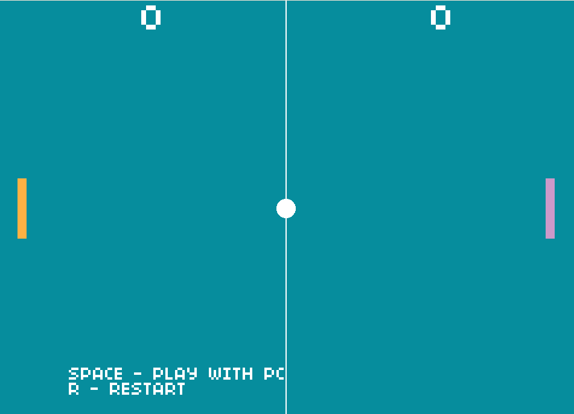
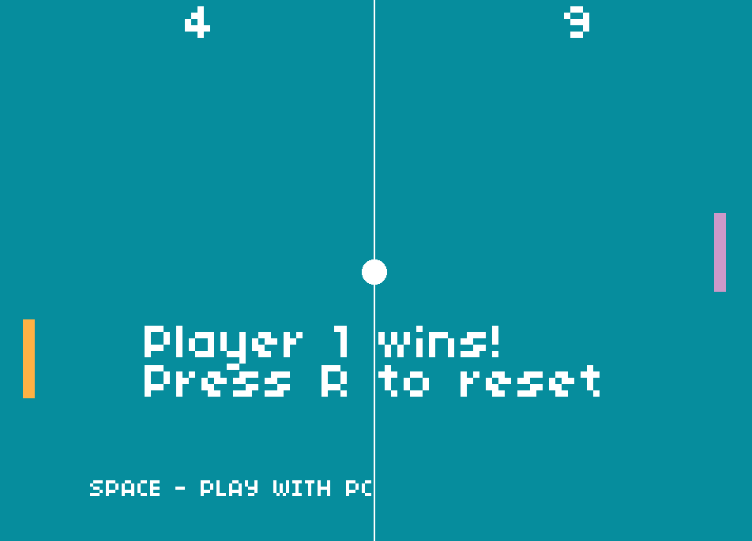

# PONG

**Reedycja klasycznej gry Pong wydanej w 1972 roku na Atari. Nowa wersja
gry została napisana przy wykorzystaniu języka C oraz biblioteki Allegro
5. Rozgrywka polega na odbijaniu piłki i osiągnięciu wyższego wyniku od
przeciwnika.**

## Funkcje i szybki tutorial:

### Pierwsze uruchomienie

  - Po uruchomieniu gry użytkownik ma możliwość ustawienia maksymalnego
    wyniku (3, 6 lub 9 punktów wymaganych do zwycięstwa), dostosowania
    koloru paletek obu graczy (do wyboru fioletowy, biały, czerwony,
    pomarańczowy, zielony oraz niebieski), a także koloru tła (tutaj
    wybór między czarnym, szarym, fioletowym lub niebieskim). Wybrane
    przez użytkownika ustawienia zostaną zapisane i wczytane przy
    ponownym uruchomieniu.

  

### Początek gry

  - Po zatwierdzeniu ustawień klawiszem ENTER gra przejdzie do głównego
    ekranu gry. Rozgrywka rozpoczne się, gdy któryś z graczy wykona
    ruch. Gracz może swobodnie przełączać między grą z drugim graczem na
    tej samej klawiaturze, bądź z komputerem za pomocą klawisza SPACE.

  

### Rozgrywka

  - Rozgrywka polega na odbijaniu piłki i zdobywaniu punktów. Piłka
    odbija się od paletek graczy i ścianek górnych i dolnych. Jeżeli
    piłka wpadnie za paletkę gracza, to przeciwnik zdobywa punkt. Po
    osiągnięciu określonego progu punktów wybranego na początku
    rozgrywki gra wyświetli informację o zwycięzcy i zapisze datę i
    wynik rozgrywki w lokalizacji /files/scores.txt.

  

## Sterowanie:

**Ogólne:**

  - 3/6/9 - zmiana maksymalnego wyniku
  - ←/→ - zmiana koloru Player 1
  - A/D - zmiana koloru Player 2
  - Q/E - zmiana koloru tła
  - SPACE - przełącza między grą z komputerem/drugim graczem
  - R - restartuje rozgrywkę
  - ESC - wyjście z gry/powrót do ustawień

**Player 1:**

  - ←/→ - ruch Góra/Dół

**Player 2:**

  - A/D - ruch Góra/Dół

## Kompilacja:

Gra była tworzona i testowana na systemie Windows 11.  
  

Do skompilowania pliku gry game.c wymagana jest biblioteka Allegro 5 (w
przypadku systemu Windows najłatwiej ją zainstalować za pomocą NuGet
bezpośrednio w Visual Studio bądź za pomocą MinGW w MSYS2).  
  
[Link do oficjalnej wiki biblioteki
Allegro 5](https://github.com/liballeg/allegro_wiki/wiki/Quickstart)  
  
**Polecenie dla systemu Windows:**  

`gcc game.c -o game.exe -lallegro -lallegro\_font -lallegro\_ttf
-lallegro\_primitives -lallegro\_audio -lallegro\_acodec  `
  
**Linux:**

` game.c -o game $(pkg-config allegro-5 allegro\_font-5
allegro\_primitives-5 allegro\_audio-5 allegro\_acodec-5 --libs
--cflags)`
  
Jeżeli po kompilacji występują problemy z uruchomieniem gry, upewnij
się, że w lokalizacji pliku znajdują się foldery: files, font i sounds
zawierające kolejno pliki scores.txt, settings.txt w files, font.ttf w
font oraz paddle.wav, score.wav, wall.wav w sounds.
